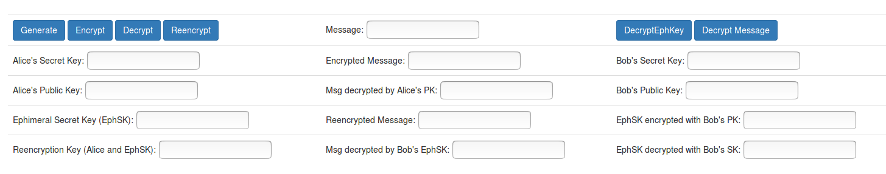

# NuCypher's Proxy Re-Encryption and Umbral

Link to their work (Proxy Re-Encryption): [Proxy Re-Encryption](https://blog.nucypher.com/proxy-re-encryption-playground-in-python-3bc66170b9bf)

Link to their work (Umbral): [Umbral](https://github.com/nucypher/pyUmbral)

## USE CASE

**Proxy Re-Encryption** is an algorithm that allows a message encrypted for User A to be re-encrypted by a proxy so that User B can decrypt it. The fantastic thing about this algorithm is that the act of re-encrypting the message (with a **reencryption key** generated by User A) **never** allows the proxy to see the underlying message, just converts the ciphertextA to ciphertextB directly. This allows messages that are meant for User A, to be transferred and re-encrypted semi-automatically (through a Proxy - which does **not** see the underlying message) for User B without User A having to be online.

**The usual procedure is that User A would have to manually decrypt the ciphertextA with its secret key and encrypt again with User B's public key.**

The following image explains the mechanism that Proxy Re-Encryption uses:

**Umbral** works in basically the same way that Proxy Re-Encryption does, with the important difference that it **splits** the re-encryption key - generated by User A into N fragments, and to correctly decrypt the message, you have to recover at least M fragments (M <= N) - M is chosen at the moment you split the re-encryption key. Doing this, you don't have to trust one single proxy, but instead, you split the responsibility between N proxys and only need M of them to respond with their corresponding fragment for User B to be able to correctly decrypt the message.

To show the capabilities of NuCypher's Re-Encryption and Umbral, 2 Proofs of Concepts (PoC) have been developed.

1. Proxy Re-Encryption
2. Umbral

# Proxy Re-Encryption

The PoC for this concept is a web application:

Which has the following buttons:

_Alice's Side_
1. Generate
2. Encrypt
3. Decrypt
4. Reencrypt

1. Generate: consumes the API "/genKeys" - generates keys for several users.
- Input: None
- Output (encoded to base 64):
  - sk_A = Secret Key of User A
  - pk_A = Public Key of User A
  - sk_B = Secret Key of User B
  - pk_B = Public Key of User B
  - sk_Eph = Secret Ephimeral Key
  - reeK = Reencryption Key - made with sk_A and sk_Eph
  
 2. Encrypt: consumes the API "/encryptA" - encrypts a message with a public key of your choosing (in base 64)
- Input:
  - pk_A (encoded to base 64): Public key of User A
  - msg: Message that wants to be encrypted.
- Output (encoded to base 64):
  - emsg = Encrypted message
 
 3. Decrypt: consumes the API "/decrypt" - decrypts an encrypted message with the secret key of the public key used to encrypt the original message.
- Input (encoded to base 64):
  - key = Key with which you wish to decrypt
  - emsg = Encrypted message
- Output:
  - msg = Decrypted message
    
 4. Reencrypt: consumes the API "/reencrypt" - reencrypts an already encrypted message with a reencryption key previously generated, so that another user can decypher the message aftewards. Also encrypts the ephimeral key previously generated with the recipients public key (pk_B) so that they can decypher the message at the receiving end.
- Input (encoded to base 64):
  - emsg = Encrypted message
  - reeK = Reencryption key
  - pk_B = Public key of User B
  - EphSK = Secret Ephimeral key
- Output (encoded to base 64):
  - BEphPK = Secret Ephimeral key encrypted with Public key of User B - to be later sent to User B
  - remsg = Reencrypted message with reeK
 
_Bob's side_
5. DecryptEphKey: consumes the API "/decryptEphKey" - decrypts the Secret Ephimeral Key with User B's Secret Key - this key is used to finally be able to decrypt the reencrypted message.
- Input (encoded to base 64):
  - sk_B: Secret Key of User B
  - BEphPK: Secret Ephimeral Key encrypted with User B's Public key
- Output (encoded to base 64):
  - EphPKDec: Secret Ephimeral key decrypted (should coincide with the Secret Ephimeral Key generated by Alice previously)
    
6. Decrypt message: consumes the same API as the decrypt button.
    
    
